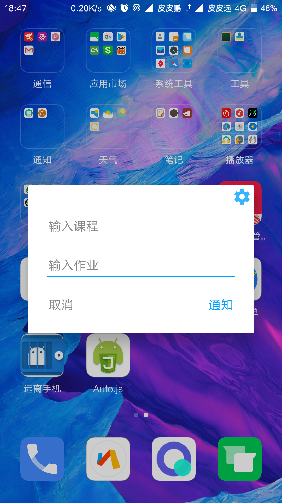
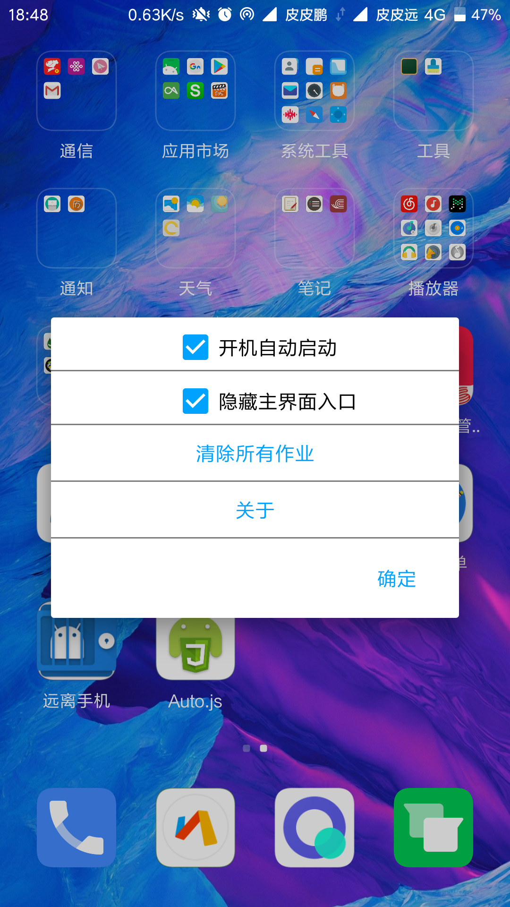
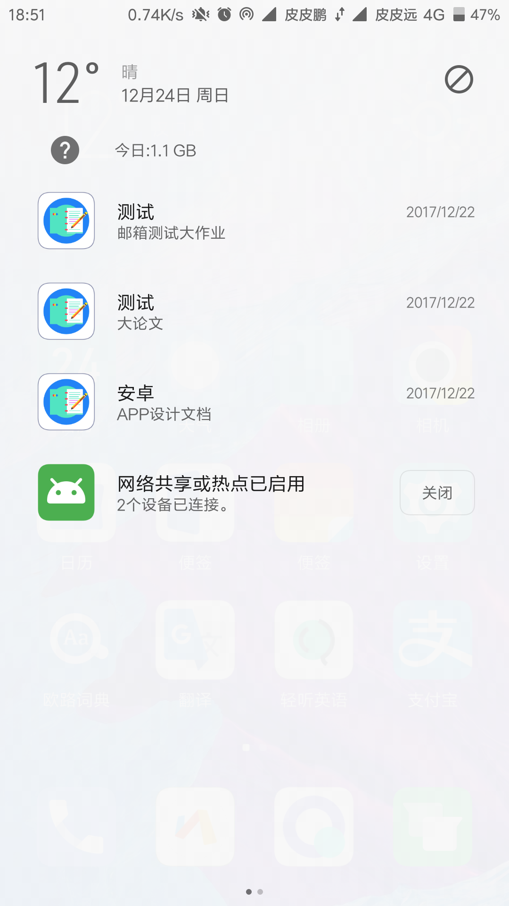

# 作业清单设计说明书

## 引言
本文档用于作业清单Android APP的设计与开发。作业清单，是一款备忘作业的提醒工具，可以将课堂上老师布置的作业挂到通知栏，可以方便地记录老师作业，并且避免了重新进入应用查看。
#### 编写目的
本文档的目的，旨在规范软件开发，推动项目有序正常的进行，使开发设计人员遵守统一的规范，从而节省制作相关文档的时间，降低系统实现的风险，加快项目实施进度，做到系统设计的规范性和全面性，以利于整个APP的设计、实现、测试、维护和版本升级。
#### 项目范围
本文档用于软件设计阶段的概要设计，它的依据是项目需求分析书，而它的作用是给项目详细设计说明书，并为详细设计说明书提供测试的依据。

## 软件概述
#### APP功能
一款作业记录提醒小工具，将作业内容发送至通知栏显示。典型应用场景比如当课堂上老师布置了作业后，用户可以用该应用记录下课程的名称，具体的作业内容并将其发送至通知栏，然后在课后需要做作业时下拉通知栏或者解锁屏幕（需要打开让通知出现在锁屏上的权限）即可，避免了自己回忆作业的内容或者再次进入应用的繁琐操作。
#### APP特色
* 支持发出多条通知
* 要增加新通知须点击启动图标进入主界面发通知，如果从已经显示在通知栏的通知点击进入则是编辑已有的通知
* 加入了快捷创建通知的通知栏快捷入口
* 支持开机自动启动

## 需求分析

#### 功能需求
* 功能划分：
 + 添加课程、作业
 
 + 设置界面更改属性
 
 + 通知栏常驻通知
 + 通知栏添加快捷入口（可取消）
 
* 功能描述：
 + 用户可以通过输入框输入想要通知的课程名和作业内容
 + 用户添加通知后，通知须常驻通知栏，不可侧滑取消通知，但可以点击通知后出现编辑页面后，再点击取消来取消这一条通知；也可以通过设置页面点击取消所有快捷通知来取消所有常驻状态栏的该应用通知
 + 用户可以通过下拉通知栏后点击快捷入口来添加新的通知，也可以在设置页面中取消该快捷入口

#### 界面需求
* 界面须保持整体清新的风格
* 界面主色调为淡蓝色，包括输入框的下划线以及设置图片和部分按钮的颜色均为淡蓝色色调

#### 性能需求
* 用户在添加通知后，通知栏须立刻出现相关的通知
* 在点击取消按钮后，通知须立即消失
* 用户如果点击取消全部通知时，通知栏该应用的通知须立刻取消
* 因为该应用须常驻后台，所以需要一直保持后台服务

## 总体结构设计
#### 运行环境设计
该应用可以运行在Android4.4-Android7.0的系统里，因为目前Android虽然刚刚推出了最新的Android O 8.0系统，但是主流的系统版本仍然是Android4.4-6.0的版本，因此本应用须在4.4-7.0的系统中运行。
